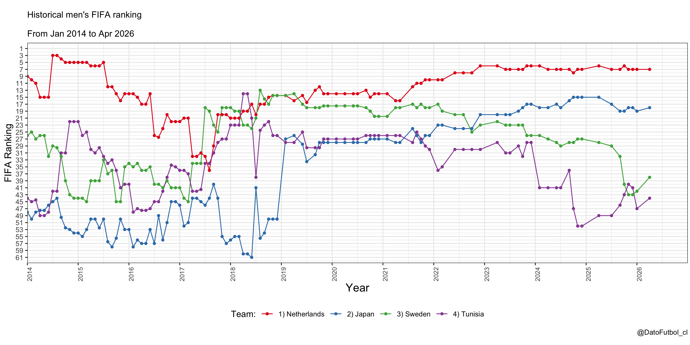

# Historical men's FIFA ranking R Shiny app

This repository contains the codes of a R Shiny app where you can visualize the men's FIFA ranking timeline of different nations.

**Live (this fork, with WC 2026 features):** <https://pjastam-fifa-ranking.share.connect.posit.cloud> — deployed on Posit Connect Cloud from the `master` branch; auto-redeploys on every push.

[Link to upstream R Shiny app](https://bustami.shinyapps.io/ranking_fifa/) (last update: Sept 2024). That version still considers some extended features done by [Piet Stam](https://github.com/pjastam) in a previous pull request.

* The data (from December 1992 to April 2026) was scraped from the official [FIFA website](https://www.fifa.com/fifa-world-ranking/men). Data is in the "ranking_fifa_historical.csv" file.

* The app has a date range selector, a "Show only WC 2026 participants" filter (on by default, restricting the team dropdowns to the 48 qualified nations), and 4 nation selectors. It is possible to visualize from 1 to 4 nations at the same time (if you prefer the 2nd, 3rd & 4th teams could be set as "None"). The default is the selection of countries from the FIFA World Cup 2026 first-round group containing the Netherlands (Netherlands, Japan, Sweden and Tunisia).

* Downloading graphs option as PNG file. 

Output example:

